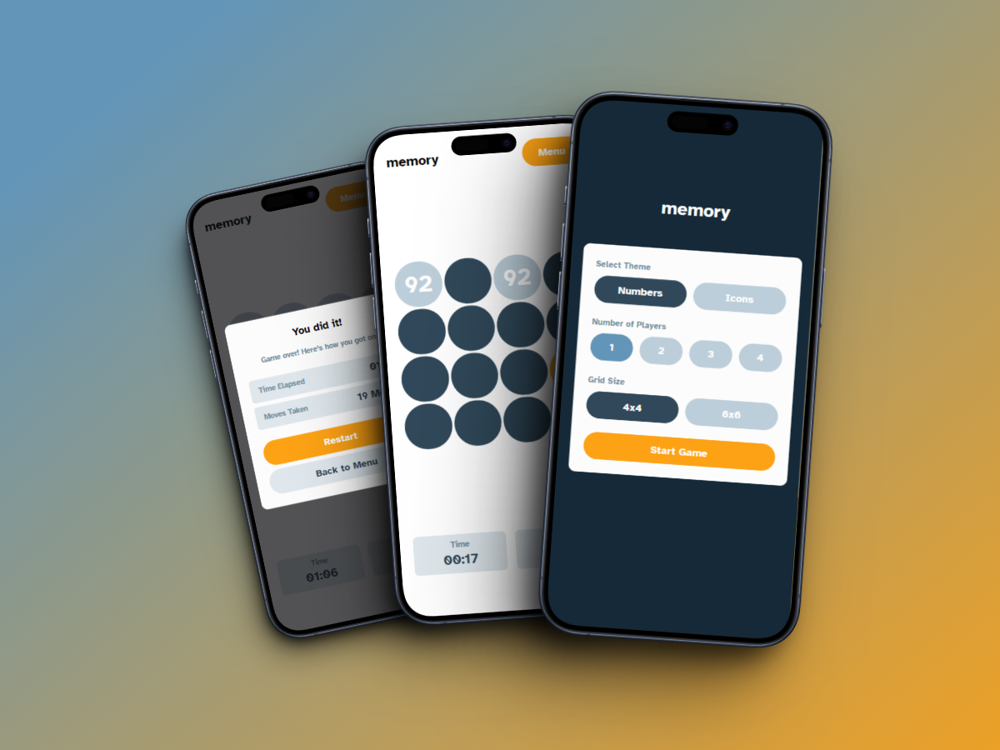
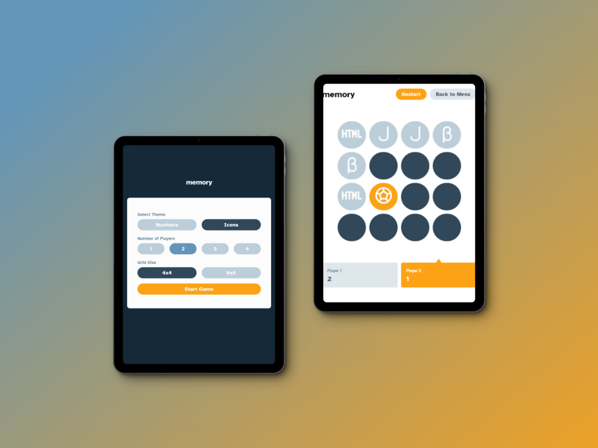
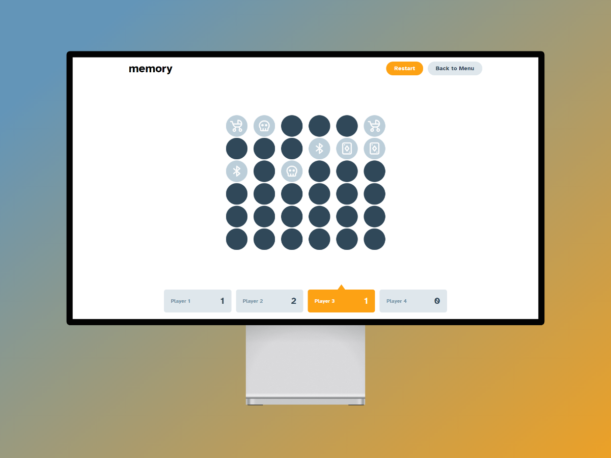

# Memory APP - Frontendmentor Challenge
El desafío consiste en la creación de una aplicación de un Memory Game.
Las pautas a seguir son las siguientes:

- Juega al juego de memoria ya sea en solitario o multijugador (hasta 4 jugadores).
- Configura el tema para usar números o iconos dentro de las fichas.
- Elige jugar en una cuadrícula de 6x6 o 4x4.
- Visualiza el diseño óptimo para el juego según el tamaño de pantalla de su dispositivo.
- Observa los estados de desplazamiento del mouse para todos los elementos interactivos en la página.

## Demo
https://memory-game-ecru-rho.vercel.app/

## Tecnologías usadas
- [Vite][1]
- [Typescript][2]
- [Tailwind][3]
- [Zustand][4]
- [Framer Motion][5]

## Screenshots

[1]: https://vitejs.dev/
[2]: https://www.typescriptlang.org/
[3]: https://tailwindcss.com/
[4]: https://zustand-demo.pmnd.rs/
[5]: https://www.framer.com/motion/